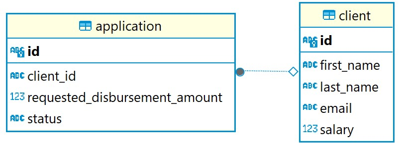

# Сервис Origination

Отвечает за обработку входящих заявок на получение кредита или ее закрытие. Использует систему версионирования БД Liquibase. Имеет две gRPC ручки: 
1. <b>CreateApplication:</b>  
   Входные данные:  
   &emsp;string first_name = 1; - имя клиента 
   &emsp;string last_name = 2; - фамилия клиента 
   &emsp;string email = 3; - эл. почта клиента 
   &emsp;uint32 salary = 4; - зарплата клиента  
   &emsp;uint32 disbursement_amount = 5; - запрашиваемое кол-во денег  
   Ответ:  
   &emsp;string application_id = 1; - идентификатор созданной заявки
2. <b>CancelApplication:</b>  
   Входные данные:  
   &emsp;string application_id = 1; - идентификатор заявки для отмены 
   Ответ:  
   &emsp;bool is_canceled = 1; - результат отмены заявки (да/нет - true/false) 

### Схема Базы Данных
