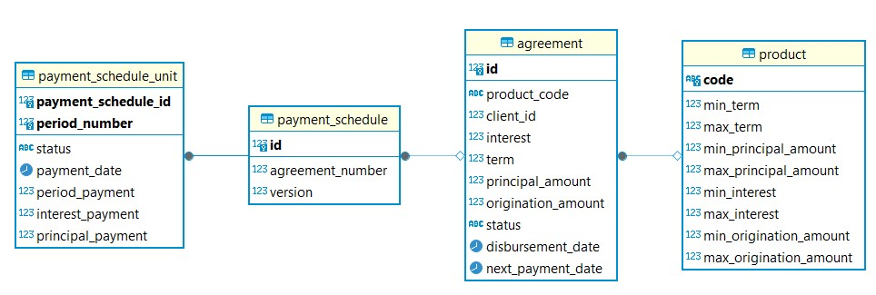

# Сервис Product Engine

Отвечает за создание договоров и графиков платежей. Использует систему версионирования БД Liquibase. Имеет четыре gRPC ручки: 
1. <b>CreateAgreement:</b>  
    Входные данные:  
   &emsp;int32 client_id = 1; - идентификатор клиента 
   &emsp;int32 loan_term = 2; - срок кредита (месяцы) 
   &emsp;double disbursement_amount = 3; - сумма кредита 
   &emsp;double interest = 4; - ставка (0.0 - 1.0)  
   &emsp;string product_code = 5; - код продукта (тип кредита)  
    Ответ:  
   &emsp;int64 agreement_id = 1; - идентификатор созданного договора
2. <b>CreateDisbursement:</b>  
    Входные данные:  
   &emsp;string disbursement_date = 1; - дата выплаты денег клиенту 
   &emsp;int64 agreement_id = 2; - идентификатор договора 
   Ответ:  
   &emsp;int64 payment_schedule_id = 1; - идентификатор созданного расписания платежей
3. <b>GetMaxPayment:(для сервиса Scoring)</b>  
   Входные данные:  
   &emsp;int32 loan_term = 1; - срок кредита (месяцы) 
   &emsp;string disbursement_amount = 2; - сумма кредита 
   &emsp;string interest = 3; - ставка (0.0 - 1.0)  
   Ответ:  
   &emsp;string payment_amount = 1; - размер максимального платежа за 1 расчетный период
4. <b>GetLoansOverdue:(для сервиса Scoring)</b>  
   Входные данные:  
   &emsp;string client_id = 1; - идентификатор клиента 
   Ответ:  
   &emsp;repeated uint32 overdue_days = 1; - если у текущего кредита есть просрочка передаем кол-во дней на сколько он 
просрочен, если есть несколько просроченных - вернется список с кол-вом просроченных дней для каждого

### Схема Базы Данных 
