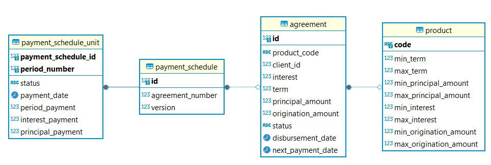

# Сервис Product Engine

Отвечает за создание договоров и графиков платежей. Использует систему версионирования БД Liquibase. Имеет две gRPC ручки: 
1. <b>CreateAgreement:</b>  
    Входные данные:  
   &emsp;int32 client_id = 1; - идентификатор клиента 
   &emsp;int32 loan_term = 2; - срок кредита (месяцы) 
   &emsp;double disbursement_amount = 3; - сумма кредита 
   &emsp;double interest = 4; - ставка (0.0 - 1.0)  
   &emsp;string product_code = 5; - код продукта (тип кредита)  
    Ответ:  
   &emsp;int64 agreement_id = 1; - идентификатор созданного договора
2. <b>CreateDisbursement:</b>  
    Входные данные:  
   &emsp;string disbursement_date = 1; - дата выплаты денег клиенту 
   &emsp;int64 agreement_id = 2; - идентификатор договора 
   Ответ:  
   &emsp;int64 payment_schedule_id = 1; - идентификатор созданного расписания платежей

### Схема Базы Данных 
